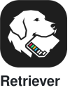

<p align="center">
  <picture>
    <source media="(prefers-color-scheme: dark)" srcset="assets/logo-dark.png">
    
  </picture>
</p>

<h1 align="center">Ponytail</h1>

<p align="center">
  <em>He says nothing. He writes one line. It works.</em>
</p>

A fork of [Dietrich Gebert’s Ponytail](https://github.com/DietrichGebert/ponytail), with a shared, outcome-preserving policy and native Pi session controls. Build the complete requested result with the simplest correct implementation. No universal safety, speed, or cost guarantee.

<p align="center">
  <sub><a href="README.es.md">Español</a> &middot; <a href="README.ko.md">한국어</a></sub>
</p>

---

<p align="center">
  <a href="https://ponytail.dev/soon"></a>
</p>

## Already built with Ponytail

<a href="https://theretriever.app">
  <picture>
    <source media="(prefers-color-scheme: dark)" srcset="assets/retriever-logo-dark.svg">
    
  </picture>
</a>

---

You know him. Long ponytail. Oval glasses. Has been at the company longer than the version control. You show him fifty lines; he looks at them, says nothing, and replaces them with one.

Ponytail puts him inside your AI agent.

## Before / after

You ask for a date picker. Your agent installs flatpickr, writes a wrapper component, adds a stylesheet, and starts a discussion about timezones.

With ponytail:

```html
<!-- ponytail: browser has one -->
<input type="date">
```

More survivors in [examples/](examples/).

## Evidence

The [historical Haiku 4.5 benchmark](benchmarks/results/2026-06-18-agentic.md) reports results for its own tasks, model, and earlier policy. It does not establish Astra performance or this release’s safety. The older [single-shot benchmarks](benchmarks/) also measure answer formatting, so fewer lines alone are not a correctness result.

Use the [native Pi evaluation](benchmarks/pi/README.md) to compare complete tasks with and without Ponytail, including repeated pairs and a holdout. Correctness and completeness gate any efficiency comparison. Native token costs are estimates; missing failure usage is unknown.

## How it works

Before writing code, the agent stops at the first rung that holds:

```
1. Is it outside the request? → omit speculative extras
2. Already in this codebase?  → reuse it, don't rewrite
3. Stdlib does it?            → use it
4. Native platform feature?   → use it
5. Installed dependency?      → use it
6. Simple implementation?     → preserve the full behavior
7. Only then: the minimum that works
```

The ladder runs *after* it understands the problem, not instead of it: it reads the code the change touches and traces the real flow before picking a rung. Lazy about the solution, never about reading.

Lazy, not negligent: trust-boundary validation, data-loss handling, security, and accessibility are never on the chopping block.

## Install

This fork ships through GitHub and Pi’s Git installer. The upstream npm and ClawHub packages are separate releases; they do not install this fork.

The Claude Code and Codex plugins (and the Cursor hooks) run two tiny Node.js lifecycle hooks, so `node` needs to be on your PATH (note for Nix/nvm users: it must be on the non-interactive shell's PATH). If it isn't, the skills still work, the always-on activation just stays quiet instead of erroring on every prompt.

### Claude Code

```
/plugin marketplace add fitchmultz/ponytail
```
```
/plugin install ponytail@ponytail
```
(You have to send two separate prompts for the install to work) 

Same steps in the Claude Code Desktop app's Code tab: type the two `/plugin` commands above into the prompt box, or click the **+** button next to it, choose **Plugins** → **Add plugin** to browse your configured marketplaces, and manage marketplaces from **Customize** in the sidebar.

### Codex

```bash
codex plugin marketplace add fitchmultz/ponytail
codex plugin add ponytail@ponytail
```

Run `codex` and open `/hooks`, review and trust its two lifecycle hooks, and start a new thread.

This same install also covers the Codex desktop app: restart the app after installing and it picks up the plugin.

### GitHub Copilot CLI

```bash
copilot plugin marketplace add fitchmultz/ponytail
copilot plugin install ponytail@ponytail
```

In an interactive Copilot CLI session, use the slash equivalents:

```
/plugin marketplace add fitchmultz/ponytail
/plugin install ponytail@ponytail
```

Copilot CLI namespaces plugin commands by plugin name. For example:

```text
/ponytail:ponytail ultra
/ponytail:ponytail-review
```

### Pi agent harness

Requires Pi **0.87.0 or newer**; validated against official 0.87.0–0.87.1 and the installed 0.87.0 fork. Earlier releases are unsupported.

```bash
pi install git:github.com/fitchmultz/ponytail@v6.0.0
```

Keep one Ponytail package configured. When switching from upstream, remove its package entry and preserve any per-skill filters on the new entry. Reload Pi after installation.

- `/ponytail` activates the configured default (`full` when the default is `off`). `/ponytail status` reports the current and default modes.
- `/ponytail lite|full|ultra|off` changes this session branch at the **next model call**, including during an active tool loop. It does not interrupt an in-flight request.
- `/ponytail default <mode>` sets the default for new sessions. Existing branches retain their initial or saved mode across resume, fork, tree navigation, and compaction. Invalid configuration is reported and left intact.
- Standalone `stop ponytail` and `normal mode` messages turn it off without a model turn. Ordinary mentions of those phrases do not change the mode.
- Workflow aliases such as `/ponytail-review <args>` preserve arguments and use native skill expansion. During work they queue as follow-ups. Disabled skills report locally instead of bypassing your filters.

The status indicator shows mode only. `quietStartup` suppresses the startup notice; `hideStatus` hides the indicator without disabling the policy. Ponytail leaves your model, reasoning effort, context limit, tools, and permissions unchanged.

The extension owns one named prompt section and leaves other sections and tools intact. A different extension that deliberately replaces the **entire** system prompt can override structured sections; that native precedence is preserved. `off` removes only Ponytail’s section, not independent repository `AGENTS.md` rules or earlier skill messages.

The core skill remains packaged for standalone use. With the extension active it is omitted from automatic skill selection; explicit `/skill:ponytail` still expands the standalone instructions and does **not** change persistent mode. Use `/ponytail` for persistent controls.

### OpenCode

Use this fork’s checkout in `opencode.json` (the plugin reuses `hooks/` and `skills/`):

```json
{ "plugin": ["./.opencode/plugins/ponytail.mjs"] }
```

Injects the ruleset every turn at the active level; adds the `/ponytail` commands (see [Commands](#commands)). OpenCode also auto-loads this repo's `AGENTS.md`, so the rules hold even without the plugin. The plugin adds the `lite/full/ultra/off` levels.

The `./` path resolves against your project's `opencode.json`; to share one checkout across projects, point it at the absolute path of the `.mjs` instead (it finds its `hooks/` and `skills/` relative to its own file).

### Gemini CLI

```bash
gemini extensions install https://github.com/fitchmultz/ponytail
```

Loads the ruleset as always-on context every session and registers the `/ponytail` commands; the `skills/` ship too, activated when a task needs them.
The Gemini adapter intentionally does not ship a root `hooks/hooks.json`: Gemini auto-loads that path, while Ponytail's lifecycle hooks use Claude/Codex event names.

### Qoder

Qoder auto-loads `AGENTS.md` from the repo root as always-on context, so running ponytail from a checkout works with zero setup. For per-project rules, copy [`.qoder/rules/ponytail.md`](.qoder/rules/ponytail.md) into your project's `.qoder/rules/`. The six ponytail skills (`/ponytail`, `/ponytail-review`, `/ponytail-audit`, `/ponytail-debt`, `/ponytail-gain`, `/ponytail-help`) are available via Qoder's Skill system; the plugin manifest at [`.qoder-plugin/plugin.json`](.qoder-plugin/plugin.json) points at the `skills/` directory.

For full plugin-tier support (automatic mode activation + ruleset injection on every prompt), add the hooks from [`hooks/qoder-hooks.json`](hooks/qoder-hooks.json) to your `.qoder/settings.json`. Replace `PONYTAIL_DIR` with the path to your ponytail checkout. Qoder's `UserPromptSubmit` hook activates the default mode on first prompt and injects the ruleset every turn; `SubagentStart` injects the ruleset into subagents. Level switches (`/ponytail lite|full|ultra|off`) work automatically.

### Antigravity CLI

Google is renaming Gemini CLI to Antigravity CLI (the `agy` binary); the same extension installs there:

```bash
agy plugin install https://github.com/fitchmultz/ponytail
```

It reuses this repo's `gemini-extension.json`. One difference: Antigravity converts the `/ponytail` commands into skills, so you type them into the chat (e.g. `/ponytail-review` as a message) instead of picking them from a slash menu. Until the migration completes (around June 18, 2026), `gemini extensions install` still works too. To run it as an always-on rule instead, drop the ruleset into `.agents/rules/`.

### Hermes Agent

```bash
hermes plugins install fitchmultz/ponytail --enable
```

Restart Hermes after installing. The plugin injects the active Ponytail mode before each LLM turn, registers the bundled skills as `ponytail:<skill>`, and adds `/ponytail`, `/ponytail-review`, `/ponytail-audit`, `/ponytail-debt`, `/ponytail-gain`, and `/ponytail-help`. In shared gateways, restrict `/ponytail` to trusted users with Hermes slash-command access controls; runtime mode is process-local.

### CodeWhale

Reads `AGENTS.md` from the project root, zero setup. Copy [`AGENTS.md`](AGENTS.md) to your project, or run `codewhale` from a checkout of this repo. That's it.

### Swival

Stage the collection in your library first, then add the skills you want:

```bash
swival skills add --global https://github.com/fitchmultz/ponytail  # stage into ~/.config/swival/library
swival skills add ponytail                                             # install the collection into this project
swival skills add --global ponytail                                    # or activate it in every project
```

Swival also reads `AGENTS.md` from the project root and `~/.config/swival/AGENTS.md` globally, the instruction-only fallback.

On the command line, use a `$` prefix to explicitly activate a skill. For example: `$ponytail-review`.

### Devin CLI

```bash
devin plugins install fitchmultz/ponytail
```

Installs ponytail as a Devin plugin; skills are available as `/ponytail:ponytail`, `/ponytail:ponytail-review`, and so on.

### OpenClaw

Copy the desired skill directories from [`.openclaw/skills/`](.openclaw/skills/) into `~/.openclaw/skills/`. Each is self-contained. ClawHub’s `ponytail` collection is maintained upstream and is not this fork’s release.

### Grok Build

```bash
grok plugin install fitchmultz/ponytail --trust
```

Enable the plugin (off by default): `/plugins` → Plugins → Space on `ponytail`, or in `~/.grok/config.toml`:

```toml
[plugins]
enabled = ["ponytail"]
```

Start a new session (or reload plugins). Skills show as `/ponytail`, `/ponytail-review`, `/ponytail-audit`, `/ponytail-debt`, `/ponytail-gain`, `/ponytail-help`. Verify with `grok inspect`. Grok can auto-invoke ponytail for coding tasks from its skill description; use `/ponytail` (or `/ponytail lite`, `/ponytail full`, `/ponytail ultra`) when activation needs to be explicit. Grok lifecycle hooks are not used because their SessionStart output cannot inject instructions.

`AGENTS.md` still works instruction-only from a checkout without the plugin.

### Cursor

```bash
git clone https://github.com/fitchmultz/ponytail
node ponytail/scripts/cursor-hooks.js install
```

Merges two native hooks into `~/.cursor/hooks.json` (add `--project` to write `<project>/.cursor/hooks.json` instead) and keeps any hooks you already have there. The entries run `node` from that checkout, so leave it where it is or re-run the install after moving it. Cursor reloads the file on save; open a new chat and the ruleset for your default level arrives through `sessionStart`. Send `/ponytail lite`, `/ponytail full`, `/ponytail ultra` or `/ponytail off` as a plain message to switch the level for the rest of the conversation; `/ponytail` reports it. Cursor's `subagentStart` cannot inject context, so subagents run without the ruleset, and cloud agents never fire `sessionStart`. The always-on rule (`.cursor/rules/ponytail.mdc`) and the hooks are alternatives: while the rule is in a workspace the hooks inject nothing and the mode commands answer with a notice, so delete the rule to let the hooks manage the level. Contract, verification record and limitations: [docs/cursor-hooks.md](docs/cursor-hooks.md). Uninstall: `node ponytail/scripts/cursor-hooks.js uninstall`.

That was it. He'd be proud. He won't say it.

Active every session, with a handful of commands (see [Commands](#commands)). `/ponytail ultra` exists for when the codebase has wronged you personally. Startup and mode-change text shows the current mode.

Set the level for every new session with the `PONYTAIL_DEFAULT_MODE` env var (`lite`/`full`/`ultra`/`off`), or a `defaultMode` field in `~/.config/ponytail/config.json` (`%APPDATA%\ponytail\config.json` on Windows). The default is `full`.

On hosts using the Claude/Codex-style Agent hook, the active ruleset is also injected into spawned subagents. To scope that to specific agent types (say, keep it off read-only search agents), set the `PONYTAIL_SUBAGENT_MATCHER` env var to a regex tested against the subagent's `agent_type`. It is unanchored and case-insensitive: `explore|general` matches either, `^general$` is exact, and plugin agent types look like `plugin:name`. Unset means inject into every subagent (the default); an invalid regex, or a subagent whose type the platform doesn't report, also falls back to injecting.

Cursor (rule-only alternative to the [hooks install](#cursor)), Windsurf, Cline, GitHub Copilot Chat (the VS Code, JetBrains, and Visual Studio editor extension, not the standalone Copilot CLI covered under [Install](#install)), Aider, Kiro, Zed, CodeWhale, Swival, Qoder: copy the matching rules file from this repo ([`.cursor/rules/`](.cursor/rules/), [`.windsurf/rules/`](.windsurf/rules/), [`.clinerules/`](.clinerules/), [`.github/copilot-instructions.md`](.github/copilot-instructions.md), [`AGENTS.md`](AGENTS.md), [`.kiro/steering/`](.kiro/steering/), [`.qoder/rules/`](.qoder/rules/)).

Kiro: copy `.kiro/steering/ponytail.md` to `~/.kiro/steering/` (global) or `.kiro/steering/` in your project.

GitHub Copilot CLI fallback (instruction-only mode): it reads `AGENTS.md` and `.github/copilot-instructions.md` in a project, or copy the rules into `~/.copilot/copilot-instructions.md` to run ponytail in every project. This path keeps always-on guidance, but does not add plugin mode switches or hooks.

VS Code with the Codex extension reads `AGENTS.md`, which this repo ships, so it works from the repo root with no setup (`~/.codex/AGENTS.md` makes Codex global).

JetBrains Junie can read `AGENTS.md` once you point it there in Settings → Tools → Junie → Project Settings → Guidelines Path (it is not automatic yet). This repo ships `AGENTS.md`; `.junie/guidelines.md` is Junie's legacy path.

Amp (Sourcegraph) reads `AGENTS.md` from the working directory and parent directories up to `$HOME`, which this repo ships, so it works with no setup (`~/.config/amp/AGENTS.md` works globally).

Jules (Google) reads `AGENTS.md` from the repository root, which this repo ships, so it picks up the ruleset with no setup.

Which files map to which agent: [Agent portability](docs/agent-portability.md).

### Uninstall

| Host | Command |
|------|---------|
| Claude Code | `/plugin remove ponytail` |
| Codex | `codex plugin remove ponytail` |
| Devin CLI | `devin plugins remove ponytail` |
| Grok Build | `grok plugin uninstall ponytail` |
| Pi agent | `pi uninstall ponytail` |
| Cursor hooks | `node scripts/cursor-hooks.js uninstall` (add `--project` for a project-level install); removes only ponytail's entries from `hooks.json` |
| Cursor rule / Windsurf / Cline / Qoder / etc. | Delete the copied rule file |

These remove the plugin's own files. They leave behind a small amount of state ponytail writes outside the plugin folder: the mode flag (`~/.claude/.ponytail-active`, or `~/.cursor/.ponytail-active` for Cursor), Claude session modes in `~/.claude/.ponytail-sessions/`, `~/.config/ponytail/config.json`, ponytail's entries in `~/.cursor/hooks.json`, and (if you accepted the setup nudge) a `statusLine` entry in `~/.claude/settings.json`. Run `node scripts/uninstall.js` to clean those up too. **Run it before the host remove command above** — the script is itself a plugin file, so removing the plugin first deletes it (or run it from a separate clone of this repo). It only removes the statusLine entry if it points at ponytail's own script, so a statusline you set up yourself is left untouched.

## Commands

| Command | What it does |
|---------|--------------|
| `/ponytail [lite \| full \| ultra \| off]` | Set the intensity, or turn it off. Bare-command behavior depends on the host; Pi activates the default. |
| `/ponytail-review` | Review the current diff for over-engineering, hands back a delete-list. |
| `/ponytail-audit` | Audit the whole repo for over-engineering, not just the diff. |
| `/ponytail-debt` | Harvest the `ponytail:` shortcuts you've deferred into a ledger, so "later" doesn't become "never". |
| `/ponytail-gain` | Explain historical benchmark results and their limits; no current-session savings claim. |
| `/ponytail-help` | Quick reference for the commands above. |

Commands need a skill-capable host (Claude Code, Codex, Devin CLI, OpenCode, Gemini, pi, Swival, Hermes Agent, Qoder, Grok Build). In Codex they're skills, invoke with `@` (`@ponytail-review`). Cursor with the [hooks](#cursor) gets `/ponytail` level switching only, typed as a plain message. The instruction-only adapters (Cursor's rule file, Windsurf, Cline, Copilot, Kiro, Antigravity) load the always-on ruleset without the commands.

## Development

Edit `hooks/ponytail-core.md` and `hooks/ponytail-modes.json` for policy changes. Node and Python read those sources directly. Workflow bodies live in `skills/ponytail-*/SKILL.md`; the core skill, static rules, command wrappers, and OpenClaw copies are generated:

```bash
npm ci --ignore-scripts
npm ci --prefix ponytail-mcp --ignore-scripts
node scripts/build-openclaw-skills.js
node scripts/check-rule-copies.js
node scripts/check-versions.js
npm test
```

The generator checks every exported policy copy; stale output fails validation. Native Pi contract tests use the pinned SDK development dependency. See [native evaluations](benchmarks/pi/README.md) for live Astra checks. GitHub releases contain the installable package; release tags are validated by CI, and this fork does not publish the upstream npm namespace.

The correctness benchmark spawns Python for email and CSV checks; `python3` is tried before `python`. CSV checks need `pandas` installed locally.

## FAQ

**Can I use it with [caveman](https://github.com/JuliusBrussee/caveman)?**
Yes, and you should. Caveman shrinks what the agent says; ponytail shrinks what it builds. Different halves, no overlap: caveman leaves code byte-for-byte exact, ponytail stays out of the prose. Terse talk about minimal code.

**Does it need a config file?**
No. An optional `~/.config/ponytail/config.json` or `PONYTAIL_DEFAULT_MODE` env var can set the default level, but nothing is required.

**What if I really need the 120-line cache class?**
If the requested behavior requires it, build it. Simplicity never cancels an explicit requirement.

**Does it scale?**
Validate the actual workload. Less code is useful only when it preserves the required behavior.

**Why "ponytail"?**
You know exactly why.

## Sponsors

<p align="center">
  <a href="https://greenpt.com/">
    <picture>
      <source media="(prefers-color-scheme: dark)" srcset="assets/logo-greenpt-dark.svg">
      
    </picture>
  </a>
</p>

## License

[MIT](LICENSE). The shortest license that works.

## Star History

<a href="https://www.star-history.com/fitchmultz/ponytail#history">
 <picture>
   <source media="(prefers-color-scheme: dark)" srcset="https://api.star-history.com/chart?repos=fitchmultz/ponytail&type=Date&theme=dark" />
   <source media="(prefers-color-scheme: light)" srcset="https://api.star-history.com/chart?repos=fitchmultz/ponytail&type=Date" />
   
 </picture>
</a>
